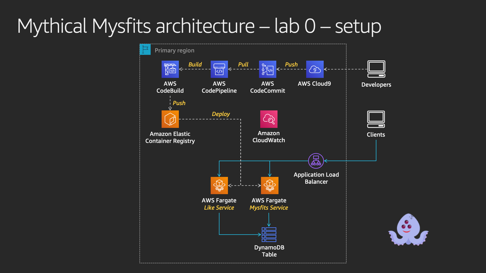
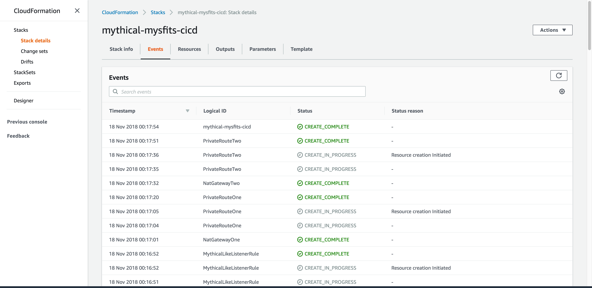

# Mythical Mysfits: Building Multi-Region Applications that Align with BC/DR Objectives

## Lab 0 - Deploy Existing Mythical Stack

In this lab, we are going to create the core infrastructure for the rest of the workshop and get familiar with the general environment.

## Table of Contents

Here's what you'll be doing:

* [Deploy Mythical CloudFormation Stack](#deploy-mythical-cloudformation-stack)
* [Familiarize Yourself with the Mythical Workshop Environment](#familiarize-yourself-with-the-workshop-environment)
* [Configure Cloud 9 Mythical Working Environment](#configure-cloud9-working-environment)
* [Choose Your Mythical Path](#stop-pay-attention-here-because-it-matters)
* [Crash Course/Refresher of CON214](#crash-courserefresher-on-workshop-1-con214-monolith-to-microservice-with-docker-and-aws-fargate)

### Deploy Mythical CloudFormation Stack

1\. Select an AWS Region

Log into the AWS Management Console and select an [AWS region](http://docs.aws.amazon.com/AWSEC2/latest/UserGuide/using-regions-availability-zones.html).  

The region dropdown is in the upper right hand corner of the console to the left of the Support dropdown menu.  For this workshop, choose either **US West (Oregon)**, **US East (Ohio)**, **EU (Ireland)** or **Asia Pacific (Singapore)**.  Workshop administrators will typically indicate which region you should use.

2\. Launch CloudFormation Stack to create core workshop infrastructure

Click on one of the **Deploy to AWS** icons below to region to stand up the core workshop infrastructure.

Region | Launch Template
------------ | -------------  
**Oregon** (us-west-2) |   
**Ohio** (us-east-2) |   
**Ireland** (eu-west-1) |   
**Singapore** (ap-southeast-1) |  

The links above will bring you to the AWS CloudFormation console with the **Specify an Amazon S3 template URL** field populated and radio button selected. Just click **Next**. If you do not have this populated, please click the link above.

4\. Configure stack options

No changes or inputs are required on the Configure stack options page.  Click **Next** to move on to the Review page.

5\. Review

On the Review page, take a look at all the parameters and make sure they're accurate. Check the box next to **I acknowledge that AWS CloudFormation might create IAM resources with custom names.** If you do not check this box, the stack creation will fail. As part of the cleanup, CloudFormation will remove the IAM Roles for you.

Click **Create** to launch the CloudFormation stack.

Here is what the templates are launching:

The CloudFormation template will launch the following:
* VPC with public subnets, routes and Internet Gateway
* An ECS cluster with no EC2 resources because we're using Fargate
* ECR repositories for your container images
* Application Load Balancer to front all your services
* Cloud9 Development Environment
* A DynamoDB table to store your mysfits and their data

## Checkpoint:

The CloudFormation stack will take a few minutes to launch.  Periodically check on the stack creation process in the CloudFormation Dashboard.  Your stack should show status **CREATE\_COMPLETE** in roughly 5-10 minutes. If you select box next to your stack and click on the **Events** tab, you can see what steps it's on.  

If there was an [error](http://docs.aws.amazon.com/AWSCloudFormation/latest/UserGuide/troubleshooting.html#troubleshooting-errors) during the stack creation process, CloudFormation will rollback and terminate. You can investigate and troubleshoot by looking in the Events tab.  Any errors encountered during stack creation will appear in the event stream as a failure.

### Familiarize yourself with the workshop environment

1\. Access your AWS Cloud9 Development Environment

In the AWS Management Console, go to the [Cloud9 Dashboard](https://console.aws.amazon.com/cloud9/home) and find your environment which should be prefixed with the name of the CloudFormation stack you created earlier, in our case mythical-mysfits-devsecops. You can also find the name of your environment in the CloudFormation outputs as Cloud9Env. Click **Open IDE**.

2\. Familiarize yourself with the Cloud9 Environment

On the left pane (Blue), any files downloaded to your environment will appear here in the file tree. In the middle (Red) pane, any documents you open will show up here. Test this out by double clicking on README.md in the left pane and edit the file by adding some arbitrary text. Then save it by clicking **File** and **Save**. Keyboard shortcuts will work as well.

On the bottom, you will see a bash shell (Yellow). For the remainder of the lab, use this shell to enter all commands.  You can also customize your Cloud9 environment by changing themes, moving panes around, etc. As an example, you can change the theme from light to dark by following the instructions [here](https://docs.aws.amazon.com/cloud9/latest/user-guide/settings-theme.html).

### Configure Cloud9 Working Environment

1\. Clone Workshop Repo

There are a number of files and startup scripts we have pre-created for you. They're all in the main repo that you're using, so we'll clone that locally. Run this:

<pre>
$ git clone https://github.com/hub714/multi-region-workshop.git
</pre>

2\. Bootstrap

There are a number of files that need to be created in order for your services to run later, so let's create them now.

<pre>
$ cd ~/environment/multi-region-workshop
$ bootstrap/setup
</pre>

# Checkpoint

You made it to the end of Lab 0. You've deployed a service.

[Proceed to Lab 1](../lab-1-xray)

