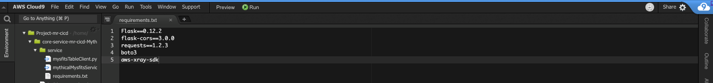

Management and Operations with AWS Fargate
====================================================

Welcome to the Mythical Mysfits team!

Mytical Mysfits is an adoption center for abandoned, often misunderstood mythical creatures in our community.  The Mysfits dev team began the process of modernizing our stack through containerization and taking strides towards a microservices architecture.  The like functionality of our main web application is a really helpful, popular feature for folks thinking about adoption, so we opted for that to be our first microservice pulled out of the monolith codebase.  It is now running as a microservice and deployed with AWS Fargate, a launch type of Amazon ECS.  

Things have been humming along, though we've recently received reports of unusual behavior with the web application, specifically with the like functionality.  Containers are a bit new to the ops team, so we need your help to explore observability of the Like microservice now that it's running on Fargate.  This means we need to think about monitoring, how we analyze logs, what sort of tracing capabilities are available (this will be very important when we launch more microservices that could potentially call out to each other), and how can we have an operational dashboard with useful alerting for on-call.  

Can you help us figure out what the unusual behavior might be?

### Requirements:

* AWS account - if you don't have one, it's easy and free to [create one](https://aws.amazon.com/).
* AWS IAM account with elevated privileges allowing you to interact with CloudFormation, IAM, EC2, ECS, ECR, ELB/ALB, VPC, SNS, CloudWatch, Cloud9, Elasticsearch Service, X-Ray. [Learn how](https://docs.aws.amazon.com/IAM/latest/UserGuide/id_users_create.html).
* Familiarity with [Python](https://wiki.python.org/moin/BeginnersGuide/Programmers), [Docker](https://www.docker.com/), and [AWS](httpts://aws.amazon.com) - *not required but a bonus*.

### What you'll do:

These labs are designed to be completed in sequence, and the full set of instructions are documented below.  Read and follow along to complete the labs.  If you're at a live AWS event, the workshop staff will give you a high-level overview of the labs and help answer any questions.  Don't worry if you get stuck, we provide hints along the way.

* **Workshop Setup:** [Setup working environment on AWS](#lets-begin)
* **Lab 1:** [Exploring The Task metadata endpoint](#lab-1---exploring-the-task-metadata-endpoint)
* **Lab 2:** [Log Analysis with CloudWatch Logs and Elasticsearch](#lab-2---log-analysis-with-CloudWatch-Logs-and-Elasticsearch)
* **Lab 3:** [Distributed Tracing and Debugging with AWS X-Ray](#lab-3---distributed-tracing-and-debugging-with-aws-x-ray)
* **Lab 4:** [Implementing Task Auto-Scaling](#lab-4-implementing-task-auto-scaling)
<!-- * **Lab 5:** [Visualising all the things with CloudWatch Dashboards](#lab-5-visualising-all-the-things-with-cloudwatch-dashboards)-->
* **Cleanup** [Put everything away nicely](#workshop-cleanup)

## Distributed Tracing and Debugging with AWS X-Ray

You've peeled back more layers of the onion by looking at ECS service metrics, container metrics, and application logs.  From this, you've discovered the source of the unusual load used to stress the **Like** microservice and used a few different tools to troubleshoot.  The Mythical Mysfits environment is simple today, but our development roadmap aims to introduce more microservices by mid-year.  The tools explored in earlier labs are effective, but what if there is a way to get a top down service map of our microservices to understand how they are performing?  

Distributed Tracing is a way to profile a request as it touches multiple microservices or other systems like databases.  Trace data helps developers identify bottlenecks and deeply inspect requests, so they know where to focus their efforts.  

AWS X-Ray is a distributed tracing service that provides an SDK for instrumentation of your application, a daemon for aggregation and delivery of trace data, and a dashboard to view a service map with trace statistics and HTTP status codes.

In this lab, you'll implement X-Ray for the Like microservice and compare its findings to what you've already discovered throughout the workshop.

### Instructions

#### 1 Add the X-Ray daemon to be a sidecar container in the Like service task definition.

The AWS X-Ray daemon is an open software application that listens for traffic on UDP port 2000, gathers raw segment data, and relays it to the AWS X-Ray API.  When deployed with Fargate, the Task IAM role authorizes it to communicate with the X-Ray API.  The workshop CFN template you ran earlier create a role that has the necessary permissions.

Further reading: [X-Ray daemon permissions documentation](https://docs.aws.amazon.com/xray/latest/devguide/xray-daemon.html#xray-daemon-permissions)
    
The setup script earlier built and pushed a Docker image that runs the X-Ray daemon to ECR.  If you're curious about the open source project and would like to review the Dockerfile behind the image, expand below.  

<details>
<summary>Learn more: X-Ray daemon github repo and Dockerfile</summary>

GitHub repository - https://github.com/aws/aws-xray-daemon 

Dockerfile -

<pre>
# Copyright 2017 Amazon.com, Inc. or its affiliates. All Rights Reserved.
#
# Licensed under the Apache License, Version 2.0 (the "License").
# You may not use this file except in compliance with the License.
# A copy of the License is located at
#
# http://www.apache.org/licenses/LICENSE-2.0
#
# or in the "license" file accompanying this file. This file is distributed
# on an "AS IS" BASIS, WITHOUT WARRANTIES OR CONDITIONS OF ANY KIND, either
# express or implied. See the License for the specific language governing
# permissions and limitations under the License.

FROM amazonlinux:1

# Download latest 2.x release of X-Ray daemon
# Unpack archive, by default unzip is not installed so do that beforehand
RUN yum install -y unzip && \
    cd /tmp/ && \
    curl https://s3.dualstack.us-east-2.amazonaws.com/aws-xray-assets.us-east-2/xray-daemon/aws-xray-daemon-linux-2.x.zip > aws-xray-daemon-linux-2.x.zip && \
    unzip aws-xray-daemon-linux-2.x.zip && \
    cp xray /usr/bin/xray && \
    rm aws-xray-daemon-linux-2.x.zip && \
    rm cfg.yaml

# Expose port 2000 on udp
EXPOSE 2000/udp

ENTRYPOINT ["/usr/bin/xray", "-b", "0.0.0.0:2000"]

# No cmd line parameters, use default configuration
CMD ['']
</pre>
</details>

1. Since you have a working X-Ray Docker image, update the **Like** microservice task definition to add it as a sidecar.

    <details>
    <summary>Learn more: ECS Task Definition</summary>

    A task definition is a JSON template that instructs ECS how to launch your container(s).  It has attributes that define things like what container(s) to run, what resources are needed, what ports to expose, and more.  If you're familiar with Docker run arguments, you'll find there are parallels.  Further reading - <a href="https://docs.aws.amazon.com/AmazonECS/latest/developerguide/task_definitions.html">ECS Documentation: Task Definitions</a>
    </details>

    Navigate to [Task Definitions](https://console.aws.amazon.com/ecs/home#/taskDefinitions) in the ECS dashboard.  

    Find the Like microservice task definition in the list; the naming format will be <code>Mythical-Mysfits-Like-Service-<b><i>STACK_NAME</i></b></code>.  

    Select the checkbox next to the task definition, and click **Create new revision**.

    Scroll down to "Container Definitions" and click **Add container**.

    Complete the following fields:
    - **Container name** - enter `x-ray-daemon`
    - **Image** - enter ***X-RAY_ECR_REPO_URI***`:latest`; this is the `XrayEcrRepo` value from your CloudFormation outputs, e.g. 123456789012.dkr.ecr.us-east-2.amazonaws.com/mmtest-xray-1s8vu050agmv5:latest
    - **Port mappings** - enter `2000` for container port and select `udp` for protocol

    Your configuration will look similar to this:
    

    Click **Add**

    Click **Create**

#### 3.2 Update the Like ECS service to use your updated task definition to also launch the X-Ray daemon sidecar.

<details>
<summary>Learn more: ECS service</summary>

An ECS service maintains a desired number of running ECS tasks.  This is ideal for long running processes like web servers.  Further reading - <a href="https://docs.aws.amazon.com/AmazonECS/latest/developerguide/ecs_services.html">ECS Documentation: Services</a>
</details>

1. Navigate to [Clusters](https://console.aws.amazon.com/ecs/home#/clusters) in the ECS dashboard.  

    Click on your workshop ECS cluster which will have a format of `Cluster`-***STACK_NAME***.  

    Check the checkbox next to the **Like** service and click **Update**.

    Configure the following fields:
    - **Task Definition** - for revision, select the latest
    - **Force new deployment** - check this box

    Your configuration will look similar to this:
    

    Click **Next step** and continue doing so until you reach the review page, then click **Update Service**

    Click **View Service** and you should see the deployment begin.  You can move on to start instrumentating the app while the deployment completes.

#### 3.3 First you need to add the X-Ray SDK as a dependency in the Like Docker image, so you can use it in the application code.  You'll use your Cloud9 IDE to do this.

1. Go to your [Cloud9](https://docs.aws.amazon.com/cloud9/latest/user-guide/welcome.html) IDE.  If you don't have that tab still open, navigate to the [Cloud9 dashboard](https://console.aws.amazon.com/cloud9/home) and click **Open IDE** for the workshop Cloud9 IDE.  The name of the environment will have the format `Project`-***STACK_NAME***.

    The setup script you ran earlier cloned the like and monolith application code to your Cloud9 IDE, which you can see in the directory tree on the left side of the IDE.  The code is stored in [AWS CodeCommit](https://docs.aws.amazon.com/codecommit/latest/userguide/welcome.html), a managed source control service.

    The Like service is a Flask application which is based on Python.  There is a [pip install](https://pip.pypa.io/en/stable/reference/pip_install/#requirement-specifiers) command in the Dockerfile that will install python packages listed in the requirements.txt file.  

2. Expand the Like service folder in the directory tree where you'll see **requirements.txt**.  

    Double-click on the file to open it in the editor, and add `aws-xray-sdk` to the list of dependencies, and save the file. (File->Save or Command-s on Mac or Ctrl-s on Windows).

    

    Now you're ready to start instrumenting the **Like** service application source code.

#### 3.4 Instrument the app to enable tracing for incoming requests to the Like service.

The X-Ray SDK for Python includes middleware that traces incoming requests for Flask (and Django) frameworks.

<details>
<summary>Learn more: What if I'm not using Flask or Django?</summary>

If you're framework is still based on python, you can <a href="https://docs.aws.amazon.com/xray/latest/devguide/xray-sdk-python-middleware.html#xray-sdk-python-middleware-manual">manually create segments</a> using the SDK.  There are also X-Ray SDKs for other programming languages like Java, Go, Node.js, Ruby, .NET.
</details>

The Mythical Mysfits dev team started looking into this, but got dragged into other priorities.  We need your help to pick up where they left off and add the required lines of code to load and activate the the middleware using your Cloud9 IDE.

1. In your Cloud9 IDE, double-click on **mysfits_like.py** in the directory tree to open the file in the editor.  Review the **Like** app code; it appears the dev team left some helpful comments to guide you along (look for `# [TODO]` comments).  Read those comments and add in the missing lines of code.

    The [X-Ray SDK for Python Middleware Documentation](
    https://docs.aws.amazon.com/xray/latest/devguide/xray-sdk-python-middleware.html#xray-sdk-python-adding-middleware-flask) is also a helpful resource to understand what's needed to load and use the middleware.

    Once you're done adding the missing lines, save the file, and expand the hint below to review your work.  If you're unsure of what to do or running out of time, you can use the hint as a reference to make the necessary additions to move on.

    <details>
    <summary>HINT: mysfits_like.py code with X-Ray middleware added.</summary>

    Here is a screenshot of what the instrumented Like service code should look like:
    

    For COPY/PASTE convenience, here are the two sections you see in the screenshot above:
    
    <pre>
    # [TODO] load x-ray recorder module
    from aws_xray_sdk.core import xray_recorder
    # [TODO] load middleware module for incoming requests
    from aws_xray_sdk.ext.flask.middleware import XRayMiddleware</pre>

    And

    <pre>
    # [TODO] x-ray recorder config to label segments as 'like service'
    xray_recorder.configure(service='like service')
    # [TODO] initialize the x-ray middleware
    XRayMiddleware(app, xray_recorder)
    </pre>

    </code>
    </details>

#### 3.5 Commit the change to Code Commit to kick off an automated deployment of your updated application code and container image requirements.

As the dev team continues down the road of microservices, they're using [AWS CodePipeline](https://docs.aws.amazon.com/codepipeline/latest/userguide/welcome.html) for continuous deployments to be more agile.  The pipeline they have set up watches for changes to the **Like** service source code master branch in AWS CodeCommit.

1. Using Cloud9, commit and push your updated Like application code and requirements file to the master branch to kick off the pipeline.  

    If you're not familiar with git commands, expand the hint below for step by step.

    <details>
    <summary>HINT: Git commands step by step</summary>

    Check that the like service code was modified.
    ```
    $ git status
    ```
    Add file to staging.
    ```
    $ git add service/
    ```
    Commit the file to your local repository.
    ```
    $ git commit -m "instrumented like service with xray"
    ```
    Push the commit to CodeCommit (remote repository)
    ```
    $ git push origin master
    ```

    The commands and output should look similar to this:
    
    </details>

    Once your code is pushed to CodeCommit, CodePipeline kicks off a build pipeline, which will pass your application files to CodeBuild.  
    
    You'll notice there's a file called **buildspec_prod.yml** in your Cloud9 directory tree.  That is the instruction set that CodeBuild uses to run the build.  
    
    Once the image artifact is created, it's pushed to ECR and then deployed by ECS/Fargate using CodeDeploy.  This whole process will take a few minutes, and you can monitor the progress in the CodePipeline dashboard.
    
2. Monitor the deployment to make sure all stages are successful.

    Navigate to the [CodeSuite dashboard](https://console.aws.amazon.com/codesuite).

    Expand the **Pipeline CodePipeline** section in the left menu.  
    
    Click on **Pipelines**, and click on the workshop pipeline which should named the same as your ***STACK_NAME***.  

    Once all stages of the pipeline are marked green, ending with the deploy stage, that means the updated container was successfully built and deployed.

    

#### 3.6 Generate some trace data.

1. Now that the Like service is instrumented, inbound requests will generate trace data.  Open the Mythical Mysfits site in a new tab.  This is the **S3WebsiteEndpoint** URL listed in your CloudFormation outputs.  

2. Click the heart icon on a few (recommended 7-9 clicks) mythical creatures to generate some requests to the like service.  

    If you open the Javascript console in your browser (e.g. in Chrome, you can find this in View->Developer->Javascript Console), you will see the requests coming in and exhibit one of three possible results - an immediate response (rare), a delayed response, or no response (i.e. a 404 HTTP code.

    

#### 3.7 Review the results in the X-Ray console.

1. Navigate to the [X-Ray dashboard](https://console.aws.amazon.com/xray/home) and you'll see the Service map which shows clients hitting the **Like** service.

    On the surface, it appears everything is fine.  The Like service shows green which means it's returning 200 OK.  And average response time is in the milliseconds.  Something doesn't add up.  

2. Explore the dashboard a little deeper and see if you can find anything interesting that matches up to your findings from earlier labs.  

    Expand the hint below for detailed steps to isolate the interesting traffic.

    <details>
    <summary>HINT: Detailed steps to find key insights</summary>

    A good place to start is to look at the traces that X-Ray has collected.  Click on **Traces** from the left menu.  

    X-Ray by default will show the `Last 5 minutes` of trace data.  Choose a longer time range like `Last 30 minutes` from the drop down in the upper right hand corner of the window, so we have more traces to review.  

    Notice an abundance of GET requests in the Trace list.  These are the ALB health checks mentioned earlier.  These are throwing off the statistics since the response time of those are in the milliseconds.  If you click on one of the GET request traces and select the **Raw data** tab, you'll see that the useragent is `ELB-HealthChecker/2.0`.  

    

    Apply a filter expression to ignore those and look specifically for - POST messages, error codes, or lengthy response times.

    Go back to the main **Traces** page by clicking on the link from the left menu.  

    Enter `service("like service") { responsetime > 1 OR error } AND http.method = "POST"` into the search bar to apply that filter.

    Earlier when you instrumented the app, you labeled your service as `like service`.  

    The statements in the `{}` filter on `response time` and `error` which maps to a `404` response code.

    And lastly we're only looking at traces for `POST` messages.

    If you want to retain this view for other users, you can create a filter expression group by selecting **Create group** in the drop down menu to the left of the search bar.

    

    Check out [X-Ray filter expression documentation](https://docs.aws.amazon.com/xray/latest/devguide/xray-console-filters.html#console-filters-syntax) for other expressions to experiment with.

    And finally, click on **Service Map** from the left menu.  You may have to reset the time range to be something longer, but notice with the filter expression applied, the service is showing stats that match up with the strange behavior, e.g. slower avg response time, and if your traces captured any 404 response codes, the colored ring around the like service will show the ratio of 404s (orange) to valid 200s (green).

    
    </details>

### Checkpoint
Congratulations!!!  You've successfully implemented X-Ray to trace inbound requests to the Like microservice and discovered valuable information and statistics.

Proceed to [Lab 2](../lab-2-agg)!

[*^ back to top*](#management-and-operations-with-aws-fargate)

## Participation

We encourage participation; if you find anything, please submit an [issue](https://github.com/aws-samples/amazon-ecs-mythicalmysfits-workshop-STAGING/issues). However, if you want to help raise the bar, submit a [PR](https://github.com/aws-samples/amazon-ecs-mythicalmysfits-workshop-STAGING/pulls)!

## License

This library is licensed under the Apache 2.0 License.
