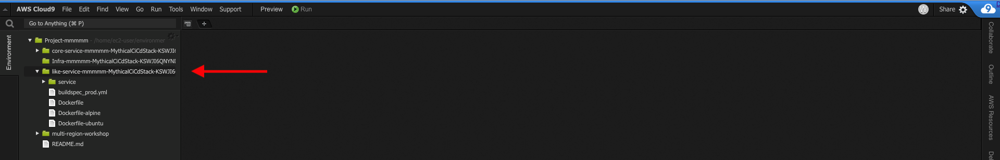

## Distributed Tracing with AWS X-Ray

Observability helps quantify how we are able to meet our availability requirements. An important aspect of observability especially in a microservices architecture is distributed tracing. This enables the ability to profile a request as it passes through our application architecture which may involve one or more services and potentially interactions with backend data stores. Data captured from traces helps teams understand how the application behaves under various conditions and can be incredibly helpful when issues arise. For example, developers can use the data to identify inefficiencies in code and prioritize their sprints. Operations or SRE teams can use the data to diagnose or triage unusual latencies or failures. Infrastructure engineers can use the data to make adjustments to resident scaling policies or resources supporting particular services.

AWS X-Ray is a distributed tracing service that provides an SDK to instrument your applications, a daemon to aggregate and deliver trace data to the X-Ray service, and a dashboard to view a service map which is a visualization of the trace data. If you would like to read more in depth about X-Ray, check out these links to documentation - [What is X-Ray?](https://docs.aws.amazon.com/xray/latest/devguide/aws-xray.html) and [X-Ray Concepts](https://docs.aws.amazon.com/xray/latest/devguide/xray-concepts.html)

In this lab, you'll continue where our lead developer left off before she was pulled to work on personalization for the application. No surprises there since the PM just got back from re:Invent, and there were many AI/ML sessions in his schedule.

The Mythical Mysfits application is made up of (2) microservices:

1. The Mysfits service serves the Angular front-end application and hosts an API that returns Mysfit profiles from DynamoDB.
2. The Like service tracks the number of likes for a particular mysfit. When a visitor clicks on the heart icon next to a mysfit in the app, a counter for that mysfit's profile is incremented in DynamoDB.

Our lead developer successfully instrumented the Mysfits service, capturing data for inbound http requests and downstream calls to DynamoDB. If you navigate to the [AWS X-Ray dashboard's service map view](http://console.aws.amazon.com/xray/home#/service-map?timeRange=PT30M), you should see some trace data.

We need your help to do the same for the Like service, so we have a more complete picture. Don't worry if you're not a developer, we'll guide you with the lab instructions and provide hints along the way. If you really get stuck, skip to the final hint where we provide the fully instrumented app code. Good luck!

### Instructions

### 1. Add the X-Ray daemon as a sidecar container in the Like service

<details>
<summary>Learn more: What is the X-Ray daemon?</summary>
The AWS X-Ray daemon is an open source software application that listens for traffic on UDP port 2000. It gathers raw segment data and relays it to the AWS X-Ray API. When deployed as a sidecar container with Fargate, the Task IAM role is what authorizes it to communicate with the X-Ray API. The workshop CloudFormation template you ran earlier already created a role that has the necessary permissions. Also, AWS X-Ray provides a managed Docker container image of the X-Ray daemon that you can run as a sidecar. If you'd like to customize the software or container image, you can find the source code on github and a sample Dockerfile in our documentation to build from.

Further reading:

* [X-Ray daemon github repo](https://github.com/aws/aws-xray-daemon)
* [X-Ray daemon permissions](https://docs.aws.amazon.com/xray/latest/devguide/xray-daemon.html#xray-daemon-permissions)
* [X-Ray sample dockerfile](https://docs.aws.amazon.com/xray/latest/devguide/xray-daemon-ecs.html#xray-daemon-ecs-build)
* [Application Tracing on Fargate with AWS X-Ray](https://github.com/aws-samples/aws-xray-fargate)
</details>

#### a. Edit the Like service task definition to include the X-Ray daemon container

<details>
<summary>Learn more: Need a refresher on ECS task definitions?</summary>

A task definition is a JSON template that instructs ECS how to launch your container(s). In it you can specify task and container resource requirements, expose listening ports, run one or more container images, and more. If you're familiar with Docker run arguments, they are similar.

Further reading: [ECS Documentation: Task Definitions](https://docs.aws.amazon.com/AmazonECS/latest/developerguide/task_definitions.html)
</details>

Navigate to [Task Definitions](https://console.aws.amazon.com/ecs/home#/taskDefinitions) in the ECS dashboard  

Find the Like microservice task definition in the list; the name will start with `Multi-Region-Like-Service-` followed by the CloudFormation stack name you set.  

Select the checkbox next to the task definition, and click **Create new revision**.

Scroll down to "Container Definitions" and click **Add container**.

Complete the following fields:

- **Container name** - enter `xray-daemon`
- **Image** - enter `amazon/aws-xray-daemon`
- **Port mappings** - enter `2000` for container port, and select `udp` for protocol

Your configuration will look similar to this:
 TODO ADD NEW SCREENSHOT

Click **Add**

Click **Create**

#### b. Update the Like service ECS service to reference the new task definition

<details>
<summary>Learn more: Need a refresher on ECS services?</summary>

An ECS service maintains a desired number of running ECS tasks.  This is ideal for long running processes like web servers.

Further reading: [ECS Documentation: Services](https://docs.aws.amazon.com/AmazonECS/latest/developerguide/ecs_services.html)
</details>

Navigate to [Clusters](https://console.aws.amazon.com/ecs/home#/clusters) in the ECS dashboard.  

Click on your workshop ECS cluster; the name will start with `Cluster-` followed by the CloudFormation stack name.  

Check the checkbox next to the **Like** service and click **Update**.

Configure the following fields:

- **Task Definition** - select the latest from the dropdown menu for revision
- **Force new deployment** - check this box

Your configuration will look similar to this:


Leave all other fields as they are and keep clicking **Next step** until you reach the review page, then click **Update Service**

Click **View Service** and you should see the deployment begin. This will take a few minutes, so feel free to move on to the next step where you'll begin to instrument the Like service.

### 2. Instrument the Like service code using the AWS X-Ray SDK and Cloud9

<details>
<summary>Learn more: The AWS X-Ray SDK</summary>

AWS provides X-Ray SDKs for many popular programming languages such as python, javascript, go, java, etc. The SDK provides interceptors to trace incoming HTTP requests, client handlers to instrument AWS SDK clients used to call other AWS services, and an HTTP client to instrument calls to other http web services. You can also patch certain supported libraries such as database clients. Support will vary with each language specific SDK, so consult the documentation to read more. Since Mythical Mysfits services are based on Flask, you'll use the python SDK. Additionally, the X-Ray SDK for Python includes middleware that traces incoming requests for Flask (and Django) frameworks. Convenient! If you aren't using either of these, but still use python for your implementation, you can use the python SDK to manually instrument segments.

Further reading:

* [What is X-Ray?](https://docs.aws.amazon.com/xray/latest/devguide/aws-xray.html)
* [AWS X-Ray SDK for Python](https://docs.aws.amazon.com/xray/latest/devguide/xray-sdk-python.html)

</details>

When instrumenting an app with the X-Ray SDK, you first need to install the SDK. For convenience, that was already done for you during workshop bootstrap. If you look at `requirements.txt` for the Like service, you'll see we include the `aws-xray-sdk` when the container image is built.

You should already have the Cloud9 IDE open from bootsrapping the workshop environment in the last lab. The bootstrap script cloned the Like service code to your Cloud9 IDE. Expand on the Like service folder in the directory tree to the left; the name will start with `like-service-` followed by the CloudFormation stack name and more text.



Expand the `service` folder and double-click on `mysfits_like.py` to load it in the editor pane. Your teammate commented the code to help guide you. You'll also notice `TODO` statements following those comments, that's where you'll add lines of code to accomplish the todo. Take a moment to review the codebase and move on to the first step once you're ready.

#### a. Import helper functions and classes from the X-Ray SDK to trace incoming HTTP requests for Flask applications and downstream calls to DynamoDB

Add (3) lines of code to:

1. Load the X-Ray recorder class from the SDK's core module
2. Load the X-Ray patch function from the SDK's core module
3. Load the middleware function for flask apps

Note: There are a couple approaches to patching client libraries using either the `patch_all` or `patch` modules. We choose the latter for specificity, but feel free to use the easy button that is the former.

Here are links to documentation to help you figure it out:

* [X-Ray Python Middleware](https://docs.aws.amazon.com/xray/latest/devguide/xray-sdk-python-middleware.html)
* [Patching libraries](https://docs.aws.amazon.com/xray/latest/devguide/xray-sdk-python-patching.html)
* [General AWS X-Ray SDK for Python API reference](https://docs.aws.amazon.com/xray-sdk-for-python/latest/reference/index.html)

<details>
<summary>HINT: Completed imports</summary>

```
# Load functions/classes from aws xray sdk to instrument this service to trace incoming 
# http requests and downstream aws sdk calls. This includes the X-Ray Flask middleware
# [TODO] load x-ray recorder class
# [TODO] load x-ray patch function
# [TODO] load middleware function for flask
from aws_xray_sdk.core import xray_recorder
from aws_xray_sdk.core import patch
from aws_xray_sdk.ext.flask.middleware import XRayMiddleware
```

</details>

#### b. Configure the X-Ray recorder

<details>
<summary>Learn more: X-Ray recorder configuration</summary>

The X-Ray recorder can be customized by setting class attributes. For example, you can name your service segments, enrich traces data with additional metadata by including service plugins, set the address/port of your daemon process (if not using the default of 127.0.0.1/udp), and more.

Further reading:

* [Configuring the X-Ray SDK for Python](https://docs.aws.amazon.com/xray/latest/devguide/xray-sdk-python-configuration.html)
* [AWS X-Ray SDK API Reference - Configure Global Recorder](https://docs.aws.amazon.com/xray-sdk-for-python/latest/reference/configurations.html)

</details>

Configure (3) attributes in the xray_recorder class to:

1. Set the name of the service to be 'Like Service'
2. Enable the ECS service plugin for additional metadata to be added to the trace
3. Configure the recorder behavior when instrumented code attempts to record data when no segment is open. The behavior we want is to log an error but continue.

Here are links to documentation to help you figure it out:

* [Service Plugins](https://docs.aws.amazon.com/xray/latest/devguide/xray-sdk-python-configuration.html#xray-sdk-python-configuration-plugins)
* [Recorder Configuration in Code](https://docs.aws.amazon.com/xray/latest/devguide/xray-sdk-python-configuration.html#xray-sdk-python-middleware-configuration-code)
* [AWS X-Ray SDK API Reference - Configure Global Recorder](https://docs.aws.amazon.com/xray-sdk-for-python/latest/reference/configurations.html)

<details>
<summary>HINT: Completed xray_recorder configuration</summary>

```
# Configure xray_recorder class to name your service and load the ECS plugin for 
# additional metadata.
# [TODO] configure the x-ray recorder with a service name and load the ecs plugin
plugins = ('ecs_plugin',)
xray_recorder.configure(
  service = 'Like Service',
  plugins = plugins,
  context_missing='LOG_ERROR'
)
```

Note: In case you're wondering why there's a trailing comma after `'ecs_plugin'`, it's because plugins is a tuple, and in Python a single value tuple or singleton requires a comma.
</details>

#### c. Patch AWS SDK clients to enable tracing of downstream calls to DynamoDB

Earlier, you imported the `patch` function from the X-Ray SDK core. Use that to patch boto3 which is used by the mysfitsTableClient.

Here is a link to documentation to help you figure it out:

* [Patching Libraries](https://docs.aws.amazon.com/xray/latest/devguide/xray-sdk-python-patching.html)

<details>
<summary>HINT: Completed boto3 patching</summary>

```
# Configure X-Ray to trace service client calls to downstream AWS services
# [TODO] patch the boto3 library
libraries = ('boto3',)
patch(libraries)
```

Note: In case you're wondering why there's a trailing comma after `'boto3'`, it's because libraries is a tuple, and in Python a single value tuple or singleton requires a comma.

</details>

#### d. And finally, configure the Flask middleware

Instantiate the Flask middleware to enable tracing.

Here's is a link to documentation to help you figure it out:

* [Adding Flask Middleware](https://docs.aws.amazon.com/xray/latest/devguide/xray-sdk-python-middleware.html#xray-sdk-python-adding-middleware-flask)

<details>
<summary>HINT: Completed enabling Flask middleware</summary>

```
# Instantiate the Flask middleware
# [TODO] configure middleware with the flask app and x-ray recorder
XRayMiddleware(app, xray_recorder)
```

Note: In case you're wondering why there's a trailing comma after `'boto3'`, it's because libraries is a tuple, and in Python a single value tuple or singleton requires a comma.

</details>

#### e. Checkpoint

You made it! The Like service should be instrumented. Reveal the final hint to compare your work.

<details>
<summary>FINAL HINT: SPOILERS AHEAD - Fully instrumented Like service code</summary>

```
#!/usr/bin/python
from __future__ import print_function
import os
import sys
import logging
import random
from urlparse import urlparse
from flask import Flask, jsonify, json, Response, request, abort
from flask_cors import CORS
import mysfitsTableClient

# Load functions/classes from aws xray sdk to instrument this service to trace incoming 
# http requests and downstream aws sdk calls. This includes the X-Ray Flask middleware
# [TODO] load x-ray recorder class
# [TODO] load x-ray patch function
# [TODO] load middleware function for flask
from aws_xray_sdk.core import xray_recorder
from aws_xray_sdk.core import patch
from aws_xray_sdk.ext.flask.middleware import XRayMiddleware

if 'LOGLEVEL' in os.environ:
    loglevel = os.environ['LOGLEVEL'].upper()
else:
    loglevel = 'ERROR'

logging.basicConfig(level=loglevel)

# Configure xray_recorder class to name your service and load the ECS plugin for 
# additional metadata.
# [TODO] configure the x-ray recorder with a service name and load the ecs plugin
plugins = ('ecs_plugin',)
xray_recorder.configure(
  service = 'Like Service',
  plugins = plugins,
  context_missing='LOG_ERROR'
)

# Configure X-Ray to trace service client calls to downstream AWS services
# [TODO] patch the boto3 library
libraries = ('boto3',)
patch(libraries)

app = Flask(__name__)
CORS(app)
app.logger

# Instantiate the Flask middleware
# [TODO] configure middleware with the flask app and x-ray recorder
XRayMiddleware(app, xray_recorder)

# The service basepath has a short response just to ensure that healthchecks
# sent to the service root will receive a healthy response.
@app.route("/")
def health_check_response():
    return jsonify({"message" : "This is for health checking purposes."})

@app.route("/mysfits/<mysfit_id>/like", methods=['POST'])
def like_mysfit(mysfit_id):
    app.logger.info('Like received.')
    if os.environ['CHAOSMODE'] == "on":
        n = random.randint(1,100)
        if n < 30:
            app.logger.warn('WARN: simulated 500 activated')
            abort(500)
        elif n < 60:
            app.logger.warn('WARN: simulated 404 activated')
            abort(404)
        app.logger.warn('WARN: This thing should NOT be left on..')
    
    service_response = mysfitsTableClient.likeMysfit(mysfit_id)
    flask_response = Response(service_response)
    flask_response.headers["Content-Type"] = "application/json"
    return flask_response

# Run the service on the local server it has been deployed to
if __name__ == "__main__":
    app.run(host="0.0.0.0", port=8080)
```

</details>

Now you are ready to check in your code and let the CI/CD pipeline build revised container images and re-deploy the Like service with Fargate.

### 3. Deploy the changes you made to the Like service

Since Mythical Mysfits moved to a microservices architecture, it was apparent that an automated CI/CD pipeline was necessary in order to remain agile. The dev team adopted [AWS CodePipeline](https://docs.aws.amazon.com/codepipeline/latest/userguide/welcome.html) which coordinates a few tasks:

1. Watches for changes in the source repository which is [AWS CodeCommit](https://docs.aws.amazon.com/codecommit/latest/userguide/welcome.html)
2. Leverages [AWS CodeBuild](https://docs.aws.amazon.com/codebuild/latest/userguide/welcome.html) to build new container images for the revised source code and pushes the created image to ECR.
3. Deploys the new image in ECR by updating the ECS Fargate service.

#### a. Check in Like service code to kick off the pipeline

In your Cloud9 terminal, navigate to the Like service folder.

```
$ cd ~/environment/like-service-[PUSH TAB TO AUTO COMPLETE AND PRESS ENTER]
```

Commit your updated code and push to master. If you're not familiar with git commands, expand the hint below for step by step.

<details>
<summary>HINT: Git commands step by step</summary>

Check that the like service code was modified.
```
$ git status
```
Add file to staging.
```
$ git add service/
```
Commit the file to your local repository.
```
$ git commit -m "instrumented like service with xray"
```
Push the commit to CodeCommit (remote repository)
```
$ git push origin master
```

The commands and output should look similar to this:


</details>

The pipeline will take a few minutes to complete, so feel free to move on to the next step. If you want to watch the pipeline, navigate to the [CodePipeline dashboard](https://console.aws.amazon.com/codesuite/codepipeline/pipelines) and click on the pipeline for the Like service. When it's completed, it will look similar to the screenshot below.


### 4. Generate some trace data

1. Now that the Like service is instrumented, inbound requests will generate trace data.  Open the Mythical Mysfits site in a new tab.  This is the **S3WebsiteEndpoint** URL listed in your CloudFormation outputs.  

2. Click the heart icon on a few (recommended 7-9 clicks) mythical creatures to generate some requests to the like service.  

    If you open the Javascript console in your browser (e.g. in Chrome, you can find this in View->Developer->Javascript Console), you will see the requests coming in and exhibit one of three possible results - an immediate response (rare), a delayed response, or no response (i.e. a 404 HTTP code.

    

#### 3.7 Review the results in the X-Ray console.

1. Navigate to the [X-Ray dashboard](https://console.aws.amazon.com/xray/home) and you'll see the Service map which shows clients hitting the **Like** service.

    On the surface, it appears everything is fine.  The Like service shows green which means it's returning 200 OK.  And average response time is in the milliseconds.  Something doesn't add up.  

2. Explore the dashboard a little deeper and see if you can find anything interesting that matches up to your findings from earlier labs.  

    Expand the hint below for detailed steps to isolate the interesting traffic.

    <details>
    <summary>HINT: Detailed steps to find key insights</summary>

    A good place to start is to look at the traces that X-Ray has collected.  Click on **Traces** from the left menu.  

    X-Ray by default will show the `Last 5 minutes` of trace data.  Choose a longer time range like `Last 30 minutes` from the drop down in the upper right hand corner of the window, so we have more traces to review.  

    Notice an abundance of GET requests in the Trace list.  These are the ALB health checks mentioned earlier.  These are throwing off the statistics since the response time of those are in the milliseconds.  If you click on one of the GET request traces and select the **Raw data** tab, you'll see that the useragent is `ELB-HealthChecker/2.0`.  

    

    Apply a filter expression to ignore those and look specifically for - POST messages, error codes, or lengthy response times.

    Go back to the main **Traces** page by clicking on the link from the left menu.  

    Enter `service("like service") { responsetime > 1 OR error } AND http.method = "POST"` into the search bar to apply that filter.

    Earlier when you instrumented the app, you labeled your service as `like service`.  

    The statements in the `{}` filter on `response time` and `error` which maps to a `404` response code.

    And lastly we're only looking at traces for `POST` messages.

    If you want to retain this view for other users, you can create a filter expression group by selecting **Create group** in the drop down menu to the left of the search bar.

    

    Check out [X-Ray filter expression documentation](https://docs.aws.amazon.com/xray/latest/devguide/xray-console-filters.html#console-filters-syntax) for other expressions to experiment with.

    And finally, click on **Service Map** from the left menu.  You may have to reset the time range to be something longer, but notice with the filter expression applied, the service is showing stats that match up with the strange behavior, e.g. slower avg response time, and if your traces captured any 404 response codes, the colored ring around the like service will show the ratio of 404s (orange) to valid 200s (green).

    
    </details>

### Checkpoint
Congratulations!!!  You've successfully implemented X-Ray to trace inbound requests to the Like microservice and discovered valuable information and statistics.

Proceed to [Lab 2](../lab-2-agg)!

[*^ back to top*](#management-and-operations-with-aws-fargate)

## Participation

We encourage participation; if you find anything, please submit an [issue](https://github.com/aws-samples/amazon-ecs-mythicalmysfits-workshop-STAGING/issues). However, if you want to help raise the bar, submit a [PR](https://github.com/aws-samples/amazon-ecs-mythicalmysfits-workshop-STAGING/pulls)!

## License

This library is licensed under the Apache 2.0 License.
