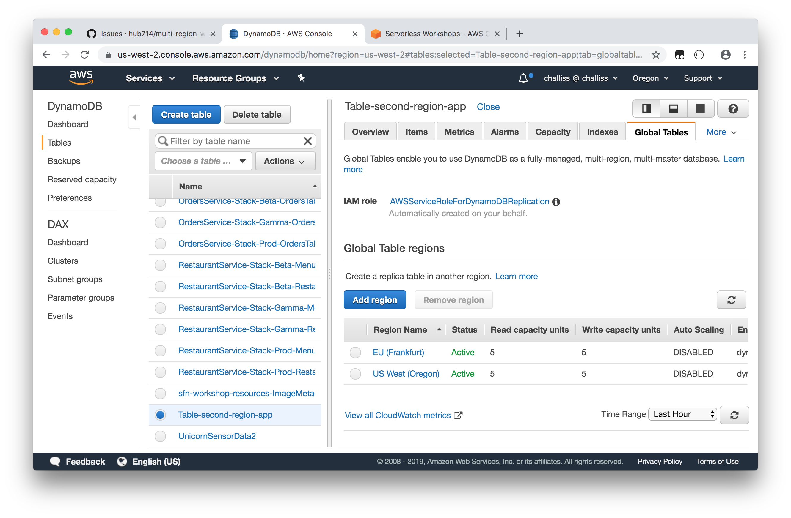
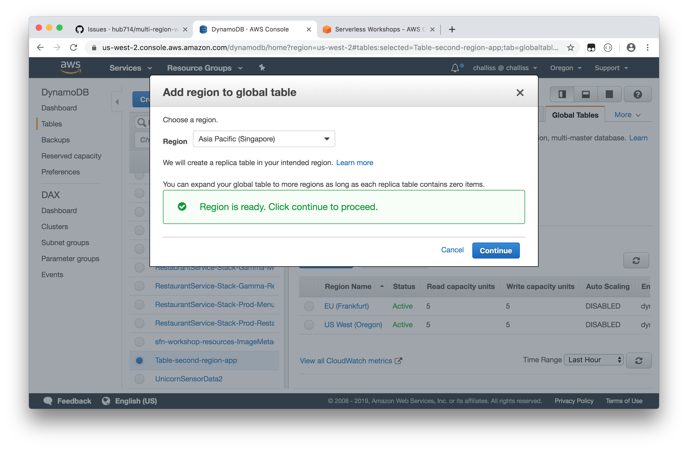

# Mythical Mysfits: Multi-Region-Workshop

## Lab 3 - Preparing for multi-region deployments
<!-- **steve has slides on this - things u may have forgotten** - it's in chat -->

In this section, you will begin preparations for moving your application to multiple regions. It's very common to forget a number of steps along the way as many people will mainly think of infrastructure and the application itself to move over, but there are a number of assets that also need to be referenced.

These are the things that we will need to replicate and also automate:
* Infrastructure
  * Network
  * Docker Repositories
  * ECS
* Container images
* Application Deployments

<!-- Here's a reference architecture for what you'll be building:

[TODO] CREATE REF ARCHITECTURE PICTURE

Here's what you'll be doing:

[TODO] CREATE TOC
* [Create AWS CodeBuild Project](#create-aws-codebuild-project)
* [Create BuildSpec File](#create-buildspec-file)
* [Test your AWS CodeBuild Project](#test-your-aws-codebuild-project) -->

### Infrastructure Replication
At the beginning of the workshop, you used AWS CloudFormation to create the infrastructure. We'll do the same thing now to replicate it, but we'll enter in a different parameter.

1. Create the AWS CloudFormation stack in your secondary region

    aws cloudformation deploy --stack-name second-region --template-file core.yml --capabilities CAPABILITY_NAMED_IAM --region us-west-2

In this section, you will begin preparations for moving your application to multiple regions. It's very common to forget a number of steps along the way as many people will mainly think of infrastructure and the application itself to move over, but there are a number of assets that also need to be referenced.

These are the things that we will need to replicate and also automate:
* Infrastructure
  * Network
  * Docker Repositories
  * ECS
* Container images
* Application Deployments

- Also need to copy over artifacts for deployment
- ECR cross region replication?
- object replication in S3
- codecommit x-region app
-

### Replicate The app to a second region

    aws cloudformation deploy --stack-name second-region --template-file core.yml --capabilities CAPABILITY_NAMED_IAM --region us-west-2

### 3.2 Replicate the Database

So now that you have a separate stack, we need to set up DynamoDB so that it automatically replicates any data created using the app in the primary region.

There's an easy way to do this - DynamoDB Global Tables. This feature will ensure we always have a copy of our data in both our primary and failover region by continuously replicating changes using DynamoDB Streams. We'll set this up now.

**Note:** In order to setup Global Tables you will need an empty table. For this lab this is not a big issue but if you are migrating from an system with existing data you will need a solution to backup/restore data or migrate from one your old table to a new table with your regions already setup for Global Tables replication. We'll leave this as an exercise ot the reader.

In your source region (double check this) DynamoDB, select the table. It will be named 'Table-' followed by your chosen stack name.

Next, choose the Global Tables tab from the top and go ahead and create your Global Table and choose your second region - just accept any messages to enable anything it needs and to create any roles it may need as well.

Now that you have created the Singapore Global Table, you can test to see if it is working by creating a new misfit in the primary app you deployed in the second module. Then, look at the DynamoDB table in your secondary region, and see if you can see the record for the ticket you just created:

### 3.3 Global Accelerator <--this should probably be its own lab4 maybe.

# Checkpoint

Proceed to [Lab 4](../lab-4-globalacc)!
