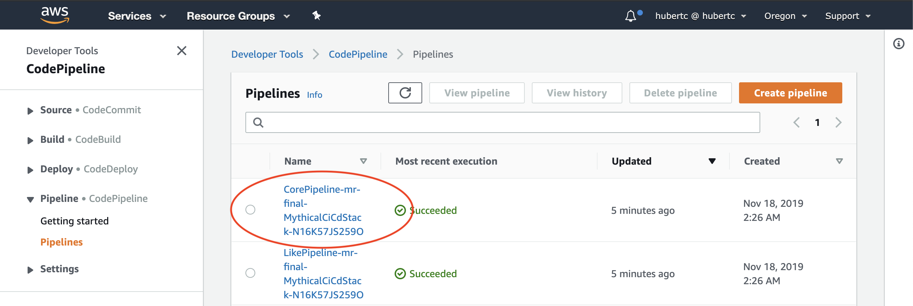
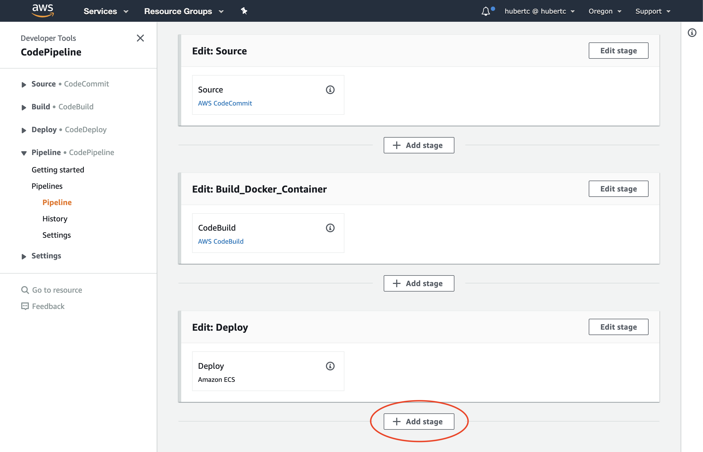
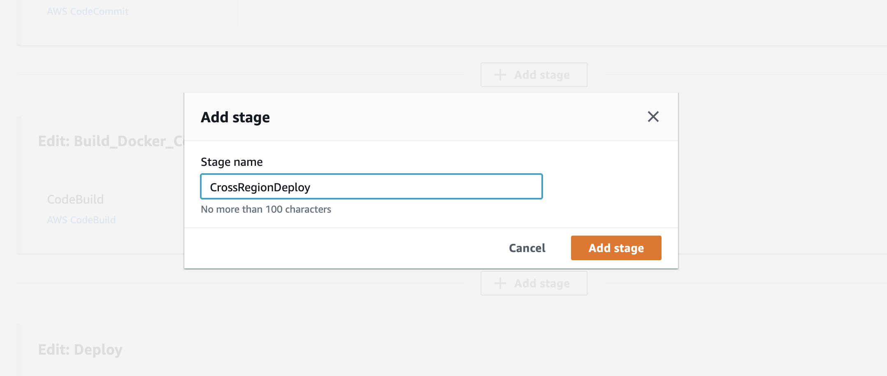

# Mythical Mysfits: Multi-Region-Workshop

## Lab 3 - Preparing for multi-region deployments
<!-- **steve has slides on this - things u may have forgotten** - it's in chat -->

In this section, you will begin preparations for moving your application to multiple regions. It's very common to forget a number of steps along the way as many people will mainly think of infrastructure and the application itself to move over, but there are a number of assets that also need to be referenced.

These are the things that we will need to replicate and also automate:
* Infrastructure
  * Network
  * Docker Repositories
  * ECS
* Container images
* Application Deployments

<!-- Here's a reference architecture for what you'll be building:

[TODO] CREATE REF ARCHITECTURE PICTURE

Here's what you'll be doing:

[TODO] CREATE TOC
* [Create AWS CodeBuild Project](#create-aws-codebuild-project)
* [Create BuildSpec File](#create-buildspec-file)
* [Test your AWS CodeBuild Project](#test-your-aws-codebuild-project) -->

### Infrastructure Replication
At the beginning of the workshop, you used AWS CloudFormation to create the infrastructure. We'll do the same thing now to replicate it, but we'll enter in a different parameter.

1\. Create the AWS CloudFormation stack in your secondary region
First we will replicate the main infrastructure using a new CloudFormation stack:

<pre>
$ cd ~/environment/multi-region-workshop
$ aws cloudformation deploy --stack-name mm-secondary-region --template-file cfn/core.yml --capabilities CAPABILITY_NAMED_IAM CAPABILITY_AUTO_EXPAND --parameter-overrides IsDrRegion=true --region us-east-1
</pre>

Once it says CREATE_COMPLETE, navigate to the Outputs tab of the stack. Note the values of:
* SecondaryLikeServiceEcrRepo
* SecondaryMythicalServiceEcrRepo

2\. Update build scripts
As part of the infrastructure automation, we gave you the application for both **core** and **like** services. You will now have to manually update the buildspec_prod.yml file to upload the container image to another region.

First, we will update the `core-service` app. Navigate to the core-service codecommit repo. You can do this in the side navigation pane or via CLI.

Console:

CLI:
<pre>
  $ cd ~/environment/<b>REPLACEME_SECONDARY_CORE_REPO_NAME</b>
</pre>

Find the buildspec_prod file in both mysfits-service and like-service. Update them to push your conainers and application to both regions. Within both of the buildspecs there are [TODO] lines to guide you through what you'll need to do. It's your choice if you want to understand how the build process works. Otherwise...

Click here for a completed buildspec and commands to copy them in:

We have created some completed buildspec files if you want to skip this portion. They are in the app/hints folder.
<pre>
  $ cp ~/environment/multi-region/workshop/app/hints/mysfits-service-buildspec_prod.yml ~/environment/<b>REPLACEME_SECONDARY_CORE_REPO_NAME</b>/buildspec_prod.yml
  $ cp ~/environment/multi-region/workshop/app/hints/like-buildspec_prod.yml ~/environment/<b>REPLACEME_SECONDARY_LIKE_REPO_NAME</b>/buildspec_prod.yml

Open the two files and update these variables:
* REPLACEME_SECONDARY_REGION in both buildspecs
* SECONDARY_CORE_REPO_URI in the Core service buildspec
* SECONDARY_LIKE_REPO_URI in the Like service buildspec
</pre>

3\. Replicate the Database

The most difficult part of a multi-region application is typically data synchronization. Now that you have a separate stack, we need to set up DynamoDB so that it automatically replicates any data created using the app in the primary region.

There's an easy way to do this - DynamoDB Global Tables. This feature will ensure we always have a copy of our data in both our primary and failover region by continuously replicating changes using DynamoDB Streams. We'll set this up now.

# It's totally possible that this will not be necessary.

**Note:** In order to setup Global Tables you will need an empty table. For this lab this is not a big issue but if you are migrating from an system with existing data you will need a solution to backup/restore data or migrate from one your old table to a new table with your regions already setup for Global Tables replication. We'll leave this as an exercise ot the reader.

In your source region (double check this) DynamoDB, select the table. It will be named 'Table-' followed by your chosen stack name.

Next, choose the Global Tables tab from the top and go ahead and create your Global Table and choose your second region - just accept any messages to enable anything it needs and to create any roles it may need as well.

Now that you have created the Singapore Global Table, you can test to see if it is working by creating a new misfit in the primary app you deployed in the second module. Then, look at the DynamoDB table in your secondary region, and see if you can see the record for the ticket you just created:

4. Automate deployments into secondary region

Now that you have all your artifacts replicated into the secondary region, you can automate the deployments too. The CICD infrastructure is already provisioned for you. To automate the deployments into the secondary region, we'll use [AWS CodePipeline's Cross-Region Actions](https://aws.amazon.com/about-aws/whats-new/2018/11/aws-codepipeline-now-supports-cross-region-actions/).

Navigate to the [CodePipeline console](http://console.aws.amazon.com/codepipeline) of the **PRIMARY** region. Click on the pipeline that starts with *Core*. Note that if your pipelines are not in a **Succeeded** state, there was a problem. Try to get your deployments into a **Succeeded** state before proceeding. You may have to re-run some setup scripts.

[TODO]: Circle Add Stage the pipeline

Click on **Edit** and **Add stage** after the Deploy stage.

[TODO]: Circle Add Stage

Type in **CrossRegionDeploy** for the stage name.

Click on **Add Action Group** and enter the following details:
Action name: **CrossRegionDeploy**
Action provider: **Amazon ECS**
Region: **Choose the secondary region you deployed into. By default, this should be US East - (N. Virginia)**
Input artifacts: **BuildArtifact**
Cluster name: **Choose the cluster that was created for you. It will start with Cluster-**
Service name:

### 3.3 Global Accelerator <--this should probably be its own lab4 maybe.

# Checkpoint

Proceed to [Lab 4](../lab-4-globalacc)!

In this section, you will begin preparations for moving your application to multiple regions. It's very common to forget a number of steps along the way as many people will mainly think of infrastructure and the application itself to move over, but there are a number of assets that also need to be referenced.

These are the things that we will need to replicate and also automate:
* Infrastructure
  * Network
  * Docker Repositories
  * ECS
* Container images
* Application Deployments

- Also need to copy over artifacts for deployment
- ECR cross region replication?
- object replication in S3
- codecommit x-region app
-

### Replicate The app to a second region

    aws cloudformation deploy --stack-name second-region --template-file core.yml --capabilities CAPABILITY_NAMED_IAM --region us-west-2
